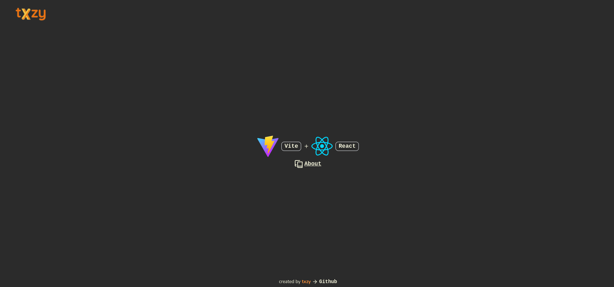

# React Starter

## [Preview Site](https://txzy2.github.io/react-starter/)

A simple, modern, and responsive clock application built with React, Vite, and TypeScript. It leverages tools like TailwindCSS, Framer Motion for animations, and Lucide Icons for a clean and interactive UI.



## Features

- ⚡ **Vite** for fast build and development
- 💅 **TailwindCSS** for responsive design and utility-first styling
- 🎨 **Framer Motion** for smooth animations
- 📦 **React Router Dom** for easy navigation
- 🛠️ **TypeScript** for type safety
- 🚀 **ESLint** for code linting and formatting
- 📄 **GitHub Pages** deployment support

## Getting Started

To get a local copy up and running, follow these steps.

### Prerequisites

Ensure you have the following tools installed:

- **Node.js** (>=18.x.x)
- **npm** or **yarn**
- **Git**

### Installation

1. Clone the repository:

   ```bash
   git clone https://github.com/txzy2/react-starter.git
   cd react-starter
   ```

2. Install dependencies:
   ```bash
   yarn
   ```

### Running the Application

To run the application locally:

1. Start the development server:

   ```bash
   yarn dev
   ```

2. Open your browser at [http://localhost:5173](http://localhost:5173) to see the app.

### Building for Production

To create an optimized production build:

```bash
yarn build
```
